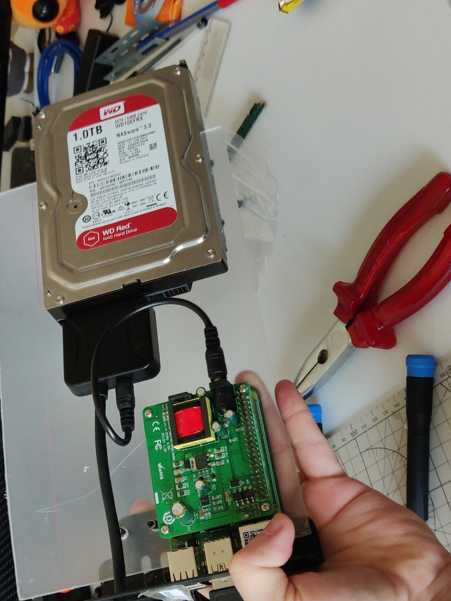
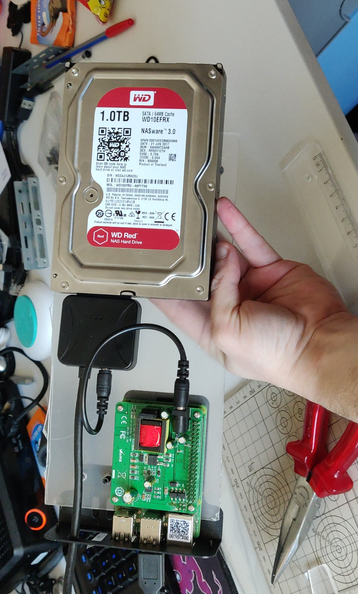
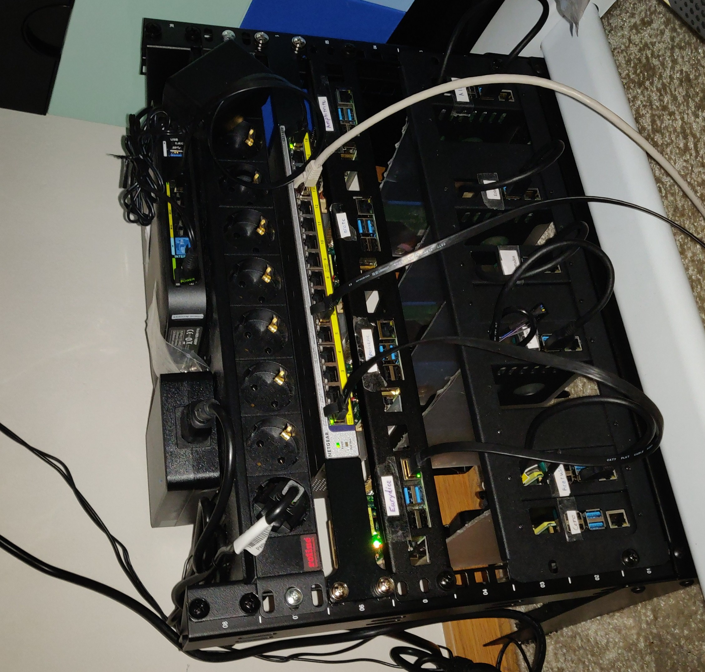

# Hardware

## Description

If you trying to do something similar, my suggestion is using Raspberry Pis 4 with <b> at least </b> 4GB of RAM (
8GB is better). The main limiting factor is memory, so the more memory you have the better.

The hardware I am currently using is:

* 5 x [Raspberry Pi 4 Model B+](https://www.raspberrypi.org/products/raspberry-pi-4-model-b/) with 8GB Ram
* 7 x [Raspberry Pi 4 Model B+](https://www.raspberrypi.org/products/raspberry-pi-4-model-b/) with 4GB RAM
* 13 x [Noctua NF-A4x20 5V PWM](https://www.amazon.de/gp/product/B071FNHVXN/ref=ppx_yo_dt_b_asin_title_o00_s00?ie=UTF8&psc=1)
* 13 x [DSLRKIT 5V 12V PoE HAT](https://www.aliexpress.com/item/32971799200.html?spm=a2g0o.productlist.0.0.3d7214c50kr1AA&algo_pvid=554775f6-14d6-4160-aa20-7cbcea1cf8b7&algo_expid=554775f6-14d6-4160-aa20-7cbcea1cf8b7-0&btsid=0b0a556016210319784736764eca5f&ws_ab_test=searchweb0_0,searchweb201602_,searchweb201603_)
* 5 x [Onvian USB 3.0 To Sata Adapter Converter Cable USB3.0](https://www.aliexpress.com/item/4000248533068.html?spm=a2g0o.productlist.0.0.283672c2357AZS&algo_pvid=c8de9200-f39c-403a-8c9d-3c5f8a0ba55a&algo_expid=c8de9200-f39c-403a-8c9d-3c5f8a0ba55a-0&btsid=0b0a556216210320334376617e35c9&ws_ab_test=searchweb0_0,searchweb201602_,searchweb201603_)
* 1 x [5TB Seagate BarraCuda](https://www.digitec.ch/en/s1/product/seagate-barracuda-5tb-25-hard-drives-5961136)
* 4 x [4TB WD Red Plus](https://www.digitec.ch/en/s1/product/wd-red-plus-4tb-35-cmr-hard-drives-634541)
* 1 x [StarTech 2-POST DESKTOP RACK - 8U](https://www.digitec.ch/en/s1/product/startech-2-post-desktop-rack-8u-server-cabinets-10147900)
* 1 x [StarTech SERVER RACK SHELF VENTED 1U ST](https://www.galaxus.ch/de/s1/product/startech-server-rack-shelf-vented-1u-st-serverschrank-10164244)
* 1 x [UCTRONICS 19 inch 3U Rack Mount](https://www.uctronics.com/19-server-rack-mounts-for-rpi-jetson-nano/uctronics-19-inch-3u-rack-mount-for-raspberry-pi-4-with-8-mounting-plates.html)
* 1 x [Raspberry Pi 19 inch Rack Mount 1U](https://www.myelectronics.nl/us/19-inch-rack-mount-1u-for-1-4-raspberry-pi.html)
* 1 x [Roline Steckdosenleiste (Rack)](https://www.digitec.ch/en/s1/product/roline-steckdosenleiste-rack-2m-socket-strips-14215745)
* 1 x [Netgear GS116PP: 16 Port Smart Switch](https://www.digitec.ch/en/s1/product/netgear-gs116pp-16-port-smart-switch-16ports-network-switches-8984850)
* 1 x [Buffalo 11ac 1166 Gigabit Wireless Dual Band Router](https://www.amazon.de/Buffalo-WZR-1166DHP-EU-Wireless-Gigabit-Parental/dp/B00EZI13D6)

You will also need sd cards for the boards and [jumper cables](https://www.digitec.ch/en/s1/product/play-zone-jumper-cables-10-pcs-mf-10cm-24awg-cables-plugs-5997954) for the fans.

Some images from the cluster:

I will not describe on how to set up DHCP, DNS, e.t.c servers because they are out of
the scope of this project. Before starting I would suggest having a good convention 
of naming your devices, because when (not not if -- do not doubt about the fact that 
hardware will fail) the hardware fails it will be difficult to locate without good 
naming conventions. I would also suggest of not hardcoding IPs, because if you have 
to scale your network and everything is hardcoded, then you are out of luck.

I would not suggest setting up the DHCP, DNS server on the kubernetes, because you will 
have a chicken and egg problem. If there is a total failure (e.g. a power outage)
you will not be able to restore the cluster. If the DHCP, DNS server is inside the 
cluster, then the services will not be able to start because the cluster is not up, 
and the cluster is not up, because there is no DHCP, DNS server. Currently I am using
a DD-Wrt router for these services. In case the router fails, I always have on stand
by an another router, that I can set up with the same parameters. Of course they 
will be a downtime, but you have to choose your fights.